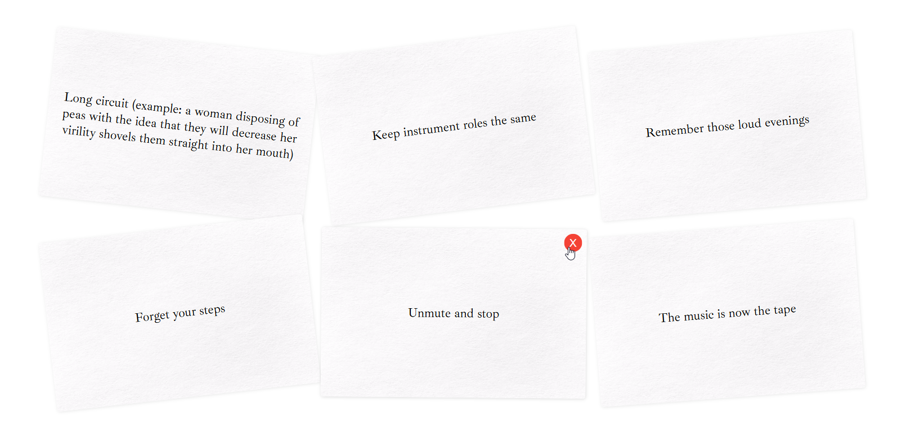

# Obscure Stratagems

A parody and ode to Oblique Strategies, originally by Brian Eno and Peter Schmidt. Draw some cards, get some inspiration.



## Background

I worked on this project to get to grips with Next.js, to create something simple but "universal."

I wanted to make the project accessible (for screenreaders and for those with different motion needs), mobile-friendly, responsive, and supportive of dark/light modes. Missing is localisation, which is beyond my monolingual means.

## Running

```bash
npm i
npm run dev
```

Runs on [http://localhost:3000](http://localhost:3000)
